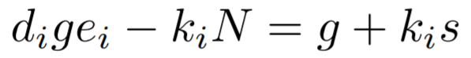

# RSA-extending-wiener-attack

An implementation of RSA extending Wiener attack, which implements the general attack method of the following paper:

Nick Howgrave-Graham, Jean-Pierre Seifert:
Extending Wiener's Attack in the Presence of Many Decrypting Exponents. CQRE 1999: 153-166

This paper is available in the following link:

https://www.sci-hub.ren/https://link.springer.com/chapter/10.1007/3-540-46701-7_14

This attack is feasible when there are many pairs (denoted the number of pairs as `n`) of RSA encryption exponents `e_i` and the corresponding **small** exponents `d_i`, which share the same modulus `N`.

This attack implementation is based on [SageMath](https://www.sagemath.org/), and the attacking approach is based on lattice reduction.

---

## Implementation Details

In Section 3.2 and Section 3.3 of the paper, it gave the exact form of the lattice construction where `n=2` and `n=3` respectively. However, for general cases, i.e., `n>3`, the paper implicitly gave a general approach in Section `3.1`, and provided a more detailed illustration in Appendix. It mainly made use of Wiener's equations (denoted as `W_i`):



and Guo's equations (denoted as `G_{i,j}`):


It generated the lattice via the multiplication of certain Wiener's equations and Guo's equations to construct the lattice. Moreover, we need to multiply the coefficients to balance the lattice, and then apply lattice reduction using the `LLL` or `BKZ` method.

After having reduced the lattice, we need to refer to Section 2.1 to find the `r`, and factor `N` by solving the quadratic equation with respect to `p` and `q`.

This repository implements the automatic generation of the equations (lattice), and can perform the attack when `n<=6` at a reasonable cost of time and memory.

---

## Example

Here is an example of the implementation.

*TODO: Add example gif or png.*

---

The BibTeX of the original paper:

```bibtex
@inproceedings{Howgrave-GrahamS99,
  author    = {Nick Howgrave{-}Graham and
               Jean{-}Pierre Seifert},
  title     = {Extending Wiener's Attack in the Presence of Many Decrypting Exponents},
  booktitle = {{CQRE}},
  volume    = {1740},
  pages     = {153--166},
  year      = {1999},
}
```